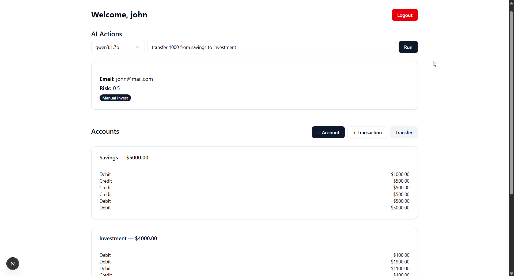
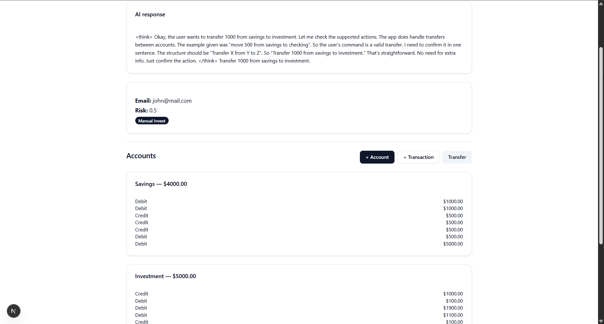
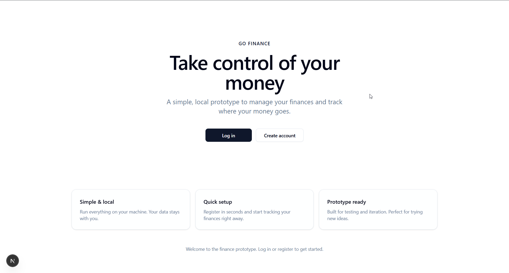
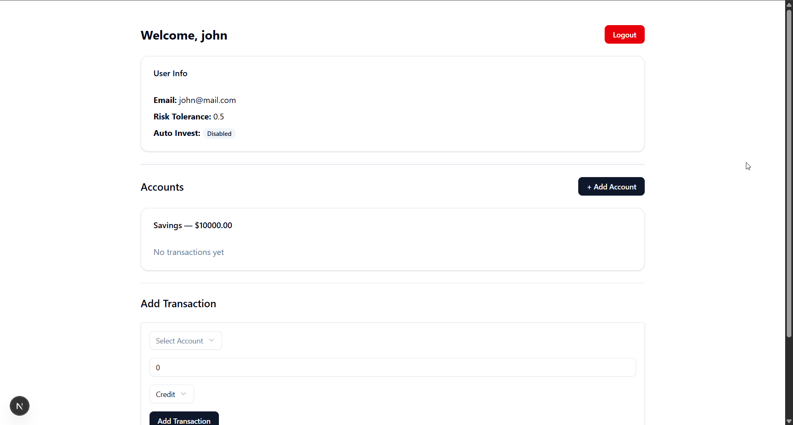
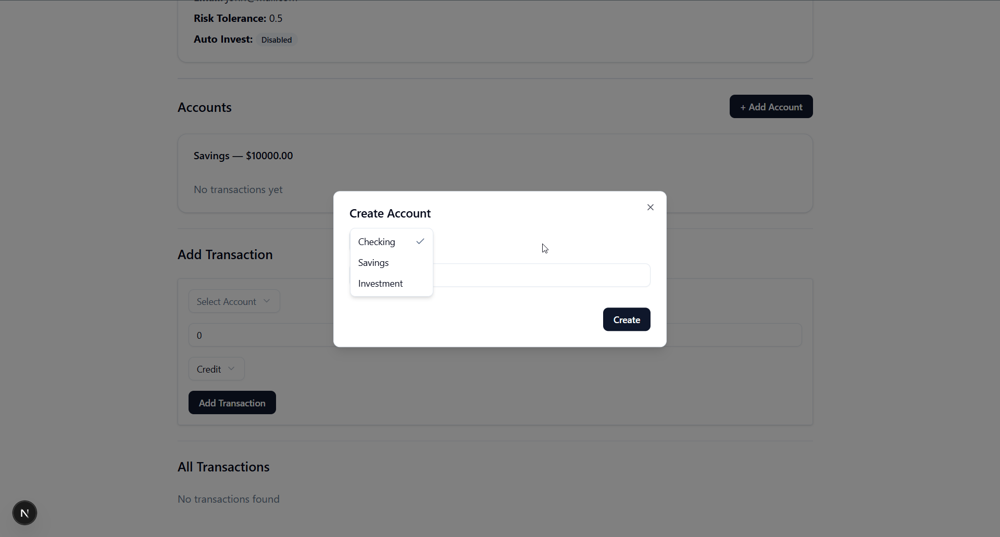

# Go + .NET gRPC Finance Stack — Prototype Update

## What This Is

A **financial platform prototype** built on a Go gateway, .NET domain core, and Next.js frontend. This document is your **status and roadmap update**: what’s live, what’s in progress, and what’s coming next.

---

## Prototype Status at a Glance

| Area | Status |
|------|--------|
| **Frontend (Next.js)** | Most features working |
| **Go Gateway + .NET Core** | In place, gRPC wired |
| **AI + Dashboard automation** | **In progress** — Text-to-Speech & automation |
| **Account transfer** | Done |
| **Stock investment** | Planned |
| **Secret features** | Teased — stay tuned |

---

## What’s Working Now

The following frontend and stack features are **currently available** in the prototype:

- **Dashboard** — Overview, layout, and core widgets
- **User flows** — Auth, preferences, and core navigation
- **REST → Go Gateway → .NET** — Full request path from browser to domain and back
- **Persistence** — Users, accounts, transactions, preferences (SQLite + EF Core)
- **Docker** — Services run in containers; portable and reproducible
- **Tests** — Automated tests in place (see screenshot below)

---

## In Progress Right Now

**AI and Text-to-Speech for dashboard automation**

The current implementation focus is:

- **AI integration** on the dashboard
- **Text-to-Speech (TTS)** to support hands-free or automated use
- **Automation** around dashboard actions and feedback

This keeps the “AI as a client” idea: automation and TTS use the same APIs and never bypass domain rules.

---

## Screenshots

### Latest Updates

This is before AI action is applied



This is after AI action has applied itself



## Prototype UI







---

## Coming Soon

Planned or partially scoped:

- **Stock investment** — Investment flows and modeling on top of the existing stack
- **Secret features** — A few extras we’re not announcing yet; they’ll land in future updates

The architecture (Go gateway, .NET domain, gRPC, REST at the edge) is designed so these can be added without rewrites.

---

## Architecture (Why It’s Built This Way)

For anyone who cares *how* this is built and *why*:

```
┌─────────────┐
│  Frontend   │  Next.js 16, TypeScript, App Router, shadcn, LLM
└──────┬──────┘
       │ REST
┌──────▼──────┐
│ Go Gateway  │  Fast I/O, routing, aggregation
└──────┬──────┘
       │ gRPC (internal)
┌──────▼────────────┐
│ .NET Domain Core  │  Business rules, invariants
└──────┬────────────┘
       │ EF Core
┌──────▼──────┐
│ SQLite / DB │  Persistent state
└─────────────┘
       │
┌──────▼──────┐
│ Docker      │  Build & run everywhere
└─────────────┘
```

- **Go** — Hot paths, REST, aggregation; no business rules.
- **.NET** — Domain logic, transactions, persistence; correctness over raw throughput.
- **gRPC** — Strong contracts (proto as source of truth), type safety, language-neutral internal API.
- **REST** — For browsers and tools; presentation layer only.
- **Docker-first** — Containers and explicit volumes; SQLite for now, Postgres-ready later.

Automation and AI (including TTS and future MCP/LLM integrations) will call the same REST or gRPC surface; the domain remains the single authority.

---

## Summary

- **Now:** Frontend and stack are working; dashboard, core flows, and tests are in place.
- **Now:** We’re adding **AI and Text-to-Speech** for dashboard automation.
- **Next:** Stock investment, and a few unannounced features.

This README will be updated as features ship. For setup and run instructions, see the project’s other docs.
